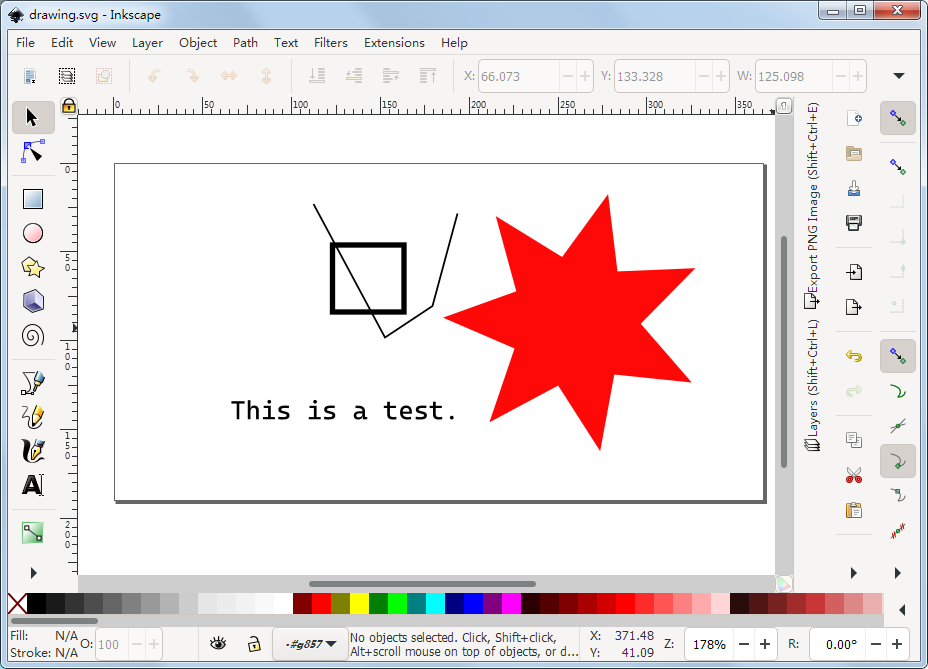
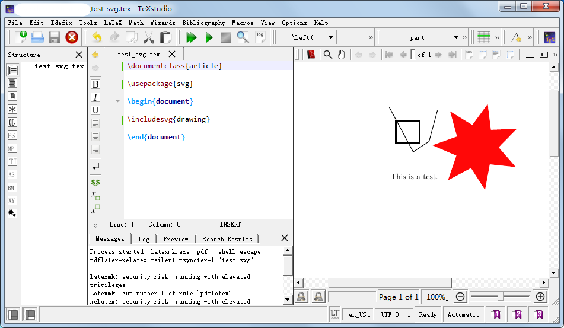
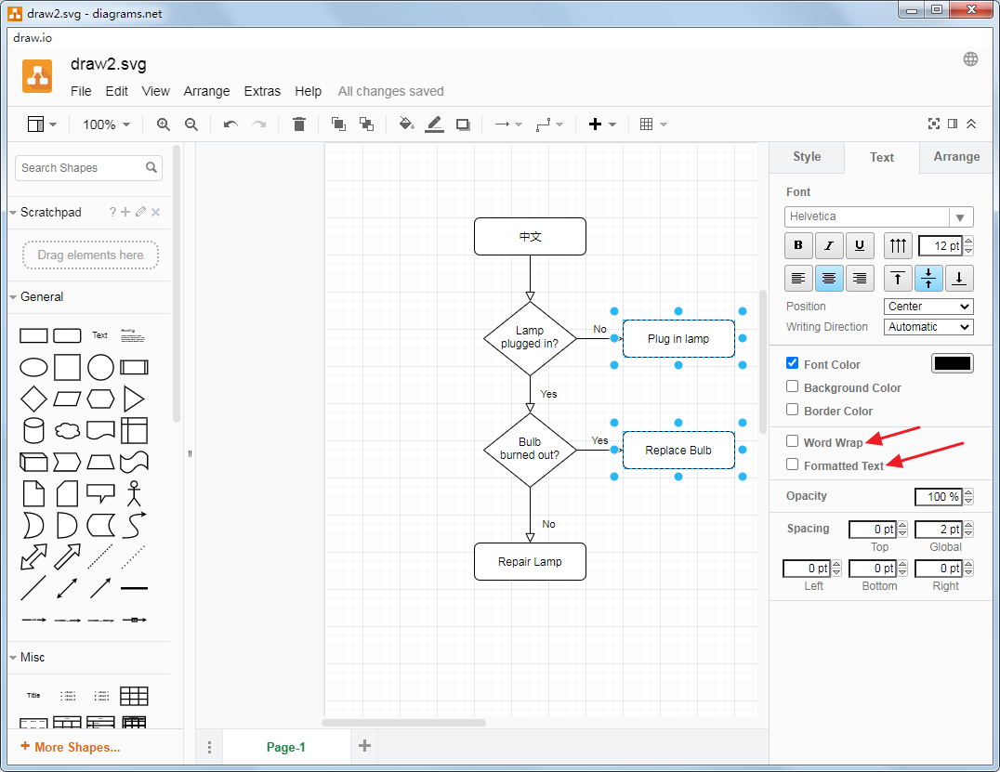
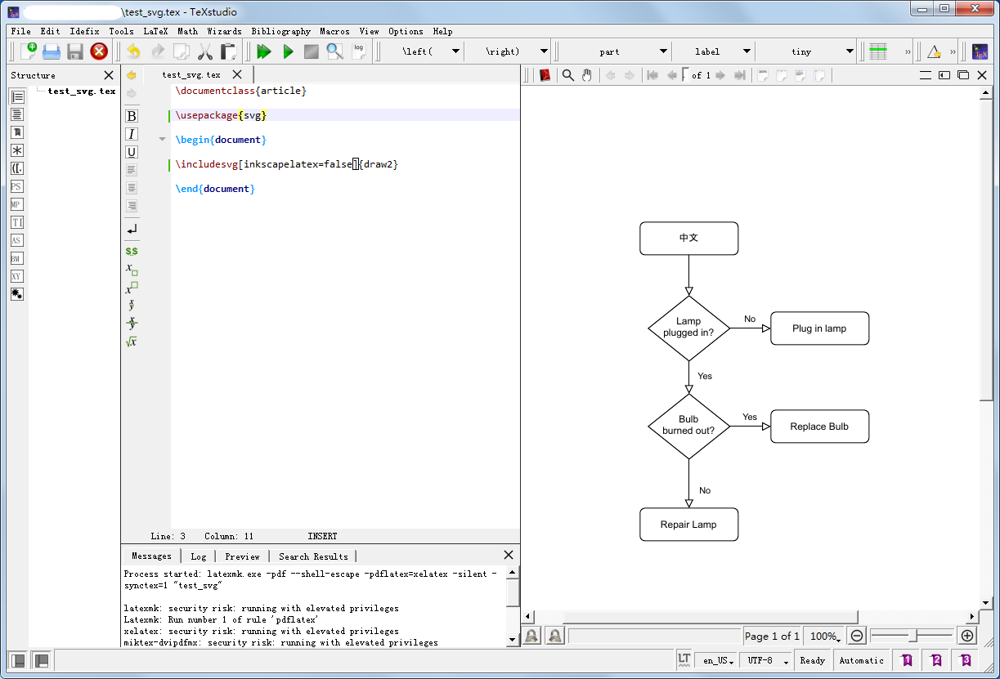

# How to import SVG image in Latex

## Prepare your Latex distribution

For me, I can use either TexLive or Miktex, make sure you use the latest version or upgrade to the latest version, because you have to use the `svg` package https://ctan.org/pkg/svg, as the time of writing this tutorial, the 2.02k 2020-11-26 is needed.

Note for the Miktex user, to run the `Latexmk`(makefile for latex), you have perl installed, for me, I use the perl comes from the msys2 https://www.msys2.org/, you can simply install the perl command line tool by the command:

`pacman -S mingw-w64-x86_64-perl`

You have `inkscape.exe` in your `PATH`, so that the `svg` package can find the `inkscape.exe` to convert the SVG file to pdf and tex file.

## Import SVG image from Inkscape

Inksape can directly save the drawing as `.svg` file, so just save a sample SVG file named `drawing.svg` in the same folder as your test `test_svg.tex`file.

~~~~
\documentclass{article}
\usepackage{svg}
\begin{document}
\includesvg{drawing}
\end{document}
~~~~

And Here is the result:

If you have Chinese characters in your SVG file, then you have to use the `xelatex` engine, and `ctexart` tex class.

Here is the code:

~~~~
\documentclass{ctexart}
\usepackage{svg}
\begin{document}
\includesvg{drawing}
\end{document}
~~~~

## Import SVG image from draw.io

draw.io is a nice tool to generate flow chart like graph.

You can download the Desktop version of drawio from this link: https://github.com/jgraph/drawio-desktop  Or you can use the online version from https://github.com/jgraph/drawio

You can save SVG file or export SVG file from the draw.io application.

Please note that for my experience, the two options should be unchecked, so that the saved/exported SVG file doesn't have long text cropped.

Now, simply wrote a text file in your favorite Latex editor, and wrote some sample tex code. Suppose you text file is saved as `test_svg.tex` and the SVG file is saved as `draw2.svg`.

~~~~

\documentclass{article}
\usepackage{svg}
\begin{document}
\includesvg[inkscapelatex=false]{draw2}
\end{document}

~~~~

Run the command

`latexmk.exe -pdf --shell-escape -pdflatex=xelatex -silent -synctex=1 "test_svg"` in my Texstudio IDE, you get the final result.

Note the code statement

~~~~
inkscapelatex=false
~~~~

Which means you don't split the SVG file to two parts(This is the job of `svg` package, it will invoke the `inkscape` command line tool, and convert the SVG file to two parts. One part is the drawing, and the other part is the text which will rendered by the Latex engine).

If you want to render the text by your Latex engine, you can remove such option, and here is the code:

~~~~
\documentclass{ctexart}
\usepackage{svg}
\begin{document}
\includesvg{draw2}
\end{document}
~~~~

Note the `ctexart` class is used in the tex file for showing the Chinese characters. Here is the result.

